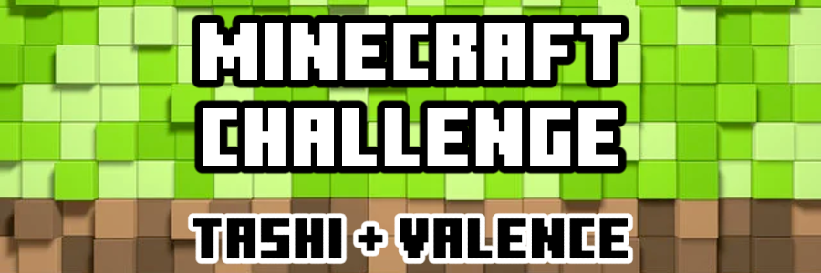
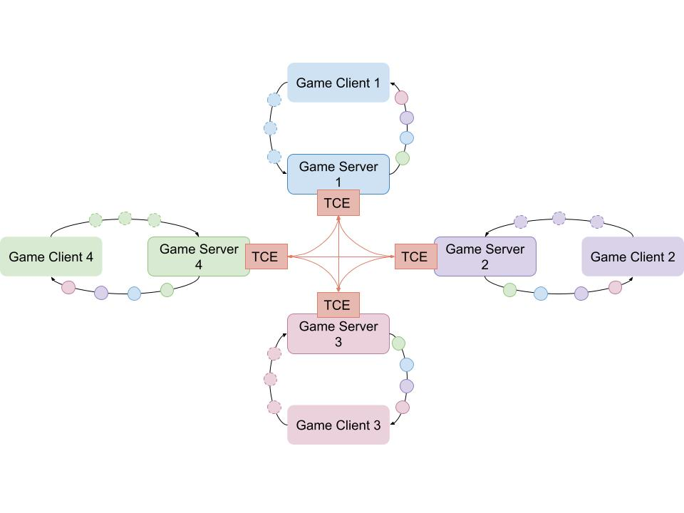

  

 

  <small>Built with ❤️ by you</small>

## 🏆 The Challenge

We are planning to demonstrate our multiplayer engine in person at devcom on August 20th in Germany.

🕹️ **Objectives**:

* an 8-player Minecraft (Java Edition) game running
* on 8 computers
* with no server
* on a LAN at the event
* with no manipulation of the game client code

🧭 **The Current Plan**:

Tashi[^1] works by having all players broadcast their inputs to each other. Then each player's Tashi instance calculates the order of all inputs. Finally, the player's game applies that stream of inputs to the current local state. You can think of Tashi as a decentralized message queue; if all players receive the same sequence of player inputs and all players start with the same state, after applying the stream of inputs, all players should end with the same state.

The hypothesis is that:

1. Valence[^2] can import the Tashi Consensus Engine ("TCE")
2. Each player run a local Valence server
3. Each players "joins" a Tashi session (multiple Valence servers talking to each other through TCE)
4. Players point their Minecraft game client to their local Valence server
5. As a game client submits game events to the local Valence Server, that server broadcasts, receives, and calculates the order of game events across all players
6. The Valence server updates the state according to the stream of ordered game events
7. The Valence servers all stay in sync, which means that the Minecraft clients stay in sync

In this model, the players should theoretically be able to play a "local" Minecraft game with multiple players, where TCE keeps all local servers in sync with each other.

[^1]: [Tashi](https://docs.tashi.gg/documentation/) is a leaderless, serverless, multiplayer engine.

[^2]: [Valence](https://github.com/valence-rs/valence) is a Rust framework for building Minecraft: Java Edition servers.

## 📜 The Terms

🗓️ **Due Date**: August 15th, 2023

💰 **Budget**: $2,500

🖋️ **Apply at**: https://discord.gg/fPNdgUCGnk

## 💬 Discussion

We realize that we are not experts in the intricacies of Valence. Our expertise is in the Tashi Consensus Engine. We expect that you will have many questions about TCE and many suggestions about how to adjust the development plan. We trust your expertise and will take your lead if you are selected.

Any other discussion is welcome in our [Discord](https://discord.gg/fPNdgUCGnk) server.

## License

This project is licensed under Apache License, Version 2.0 ([LICENSE](LICENSE) or http://www.apache.org/licenses/LICENSE-2.0)
